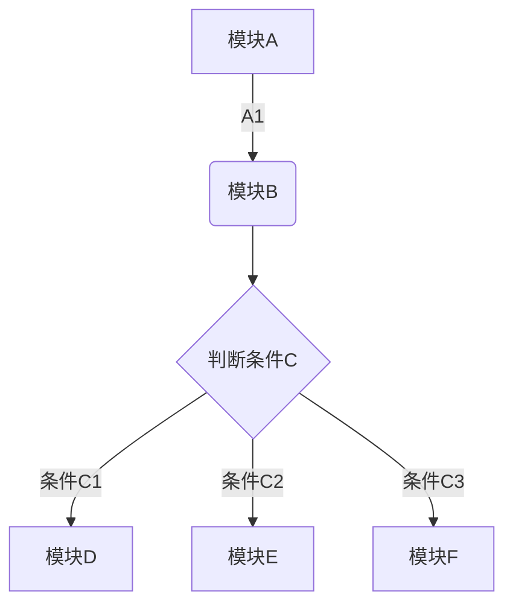
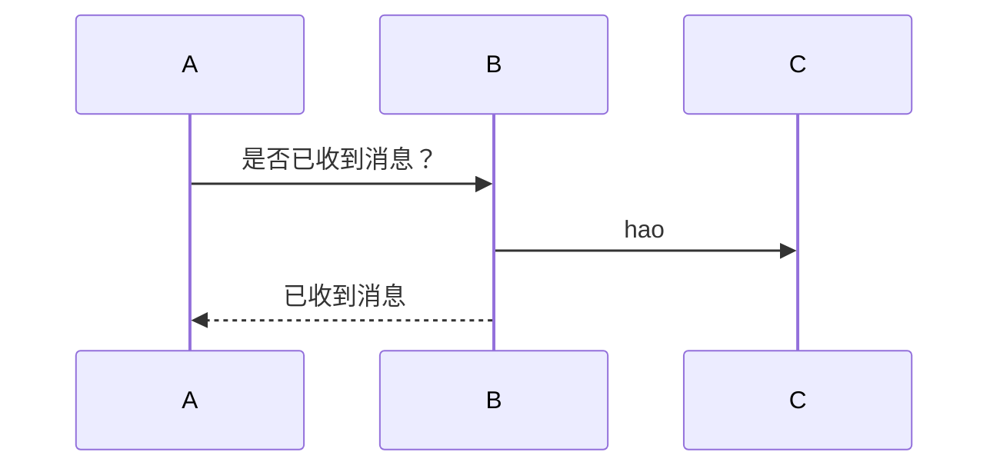

# 标题一
## 标题二
**加粗**
*斜杠*
<u>下划线</u>
~~删除线~~

* * * 
>引用块

* 原点列表

1. 数字列表1
2. 数字列表2

* [ ] 任务

[链接](http:www.baidu.com)
我现在写了一个段落，并且想在这个段落的某一个地方[图片上传失败...(img/pacman.jpg)]引入一张图片


```

```

```math
e^{i\pi} + 1 = 0
```






```
graph LR
	绘图 --> 导出图像
	导出图像 --> 上传服务器
	上传服务器 --> 文章插入
```


